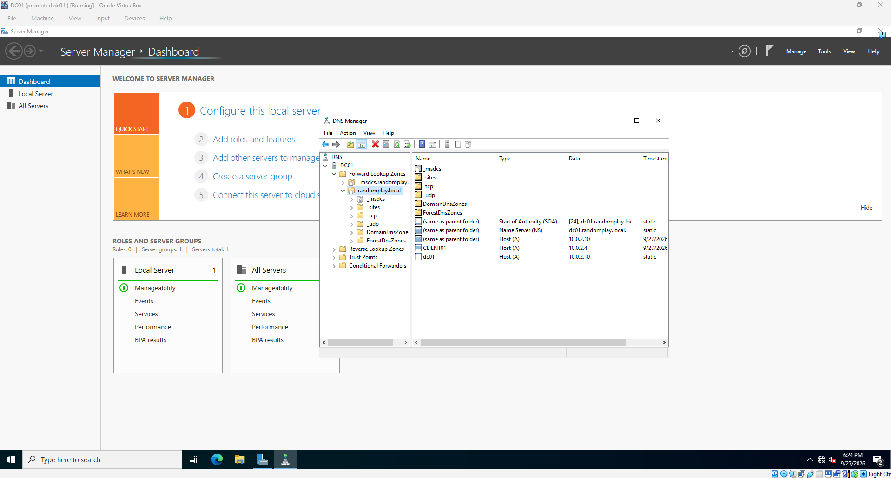
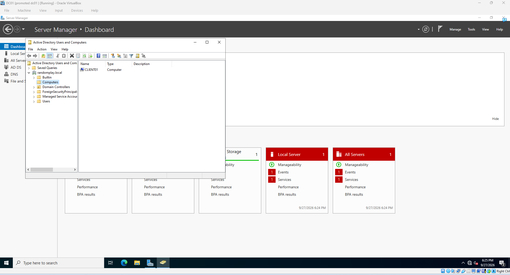

# Active Directory Home Lab

This is a learning project to practice the day-to-day work of an IT help desk:
managing users, computers, permissions, and troubleshooting domain issues.
Using VirtualBox, I virtualized a Windows domain using Windows Server 2022 for
the domain controller and Windows 11 Enterprise for the client.

This lab simulates an IT environment for Random Play, a small fictional company.

## Environment Setup

- **Domain controller (DC01)**: 10.0.2.10 (static IP), Windows Server 2022
- **Domain-joined workstation (CLIENT01)**: DHCP, Windows 11 Enterprise
- **Hypervisor**: VirtualBox
- **Network**: NAT Network (10.0.2.0/24) so both virtual machines can speak to each other and the internet
- **Domain**: randomplay.local

## Progress

### Domain Controller

- Installed Windows Server 2022 and gave it a static IP of 10.0.2.10. The DC is
  also the DNS server, so its address can't change or clients would lose the
  ability to find the domain.
- Installed Active Directory Domain Services and promoted the server to the
  first domain controller of a new forest.
- DNS was installed during promotion and automatically created the SRV records
  clients use to locate the domain controller.

### Client

- Installed Windows 11 Enterprise and pointed its DNS to the DC.
- Verified name resolution with nslookup before joining.
- Joined the randomplay.local domain and signed in with the domain Administrator account.

### Users, Groups, and Permissions

- Built an OU structure containing Users (containing 4 different departments: IT, Sales, HR, and Finance), Groups and Workstations.
  Used custom OUs instead of default containers so Group Policy can be applied

- Created 8 employee accounts across the 4 departments (2 per) with temporary passwords that the employees must change on first login (mirroring real onboarding).
- Also created 2 accounts for myself, a standard account and an admin account. Made the admin account member of the Domain Admins group, giving it permissions. 
- Created security groups for each department deciding what users can access and assigned users to groups.

- Logged in to CLIENT01 as a regular employee and was prompted to create a new password on first login with the temporary password as expected.

- Confirmed admin tools were blocked for the standard user, then used Run as
  administrator and approved the UAC prompt with my admin account. This works
  because Domain Admins is nested in the workstation's local Administrators
  group when it joins the domain.

## Bumps Along the Road

- Running nslookup returned "Server: UnKnown." The lookup still worked. The
  warning happens because there's no reverse lookup zone, so nslookup can't
  resolve the DNS server's IP back to a name.
- A new user's first password change was rejected. The default domain password
  policy blocks passwords that contain the user's name or match a recent
  password, including the temporary one.

## TODO

- Help desk scenarios: password resets, lockouts, onboarding, offboarding
- Group Policy (password policy, mapped drives)
- Group-based shared folder permissions
- PowerShell script for bulk user creation